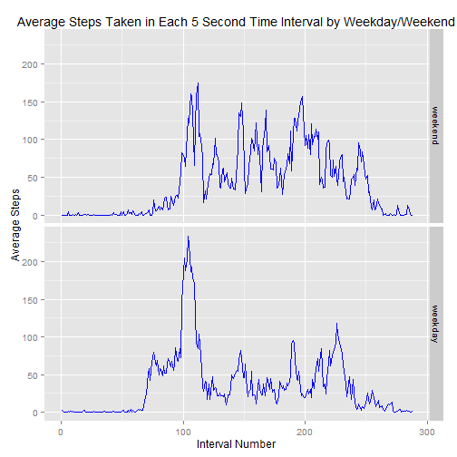

Reproducible Research: Peer Assessment 1  
================================================
 


## Loading and preprocessing the data  
  
#### 1. Load the data  


```r
temp <- tempfile()
download.file("https://d396qusza40orc.cloudfront.net/repdata%2Fdata%2Factivity.zip",temp)
data <- read.csv(unz(temp, "activity.csv"))
unlink(temp)
```

#### 2. Process/transform the data (if necessary) into a format suitable for your analysis  


```r
#convert the date variable, currently chr format, to date format
data$date <- as.Date(data$date, format="%Y-%m-%d")
data$interval <- as.factor(data$interval)
```


## What is mean total number of steps taken per day?  
  
#### 1. Calculate the total number of steps taken per day  


```r
bydate <- summarise(group_by(filter(data, steps != "NA"), date), steps.bydate = sum(steps))
```

#### 2. Make a histogram of the total number of steps taken each day  


```r
qplot(steps.bydate, data=bydate,   geom="histogram", binwidth = 500,
                  main = "Figure 1. Histogram of Total Steps per Day",
                  xlab="Steps", 
                  ylim = c(0,13),
                  fill=I("gray"),
                  col=I("blue")
      )
```

 

#### 3. Calculate and report the mean and median of the total number of steps taken per day  


```r
mean_steps <- mean(bydate$steps.bydate)
median_steps <- median(bydate$steps.bydate)
```

The mean steps per day is **1.0766189 &times; 10<sup>4</sup>**.  
The median steps per day is **10765**.  


## What is the average daily activity pattern?  

#### 1. Make a time series plot of the 5-minute interval (x-axis) and the average number of steps taken, averaged across all days (y-axis) 


```r
bytime <- summarise(group_by(filter(data, steps != "NA"), interval), steps.bytime = sum(steps))

p <- ggplot(bytime, aes(x=as.integer(interval), y=steps.bytime, group=1))
p + geom_line(color = "blue") +
      labs(title = "Average Steps Taken in Each 5 Second Time Interval") +
      labs(x = "Interval Number", y = "Average Steps") 
```

 

#### 2. Which 5-minute interval, on average across all the days in the dataset, contains the maximum number of steps?  


```r
maxint <- filter(bytime, steps.bytime == max(bytime$steps.bytime))
```

The 5-minute interval during which the maximum number of steps were taken is **835**.  


## Imputing missing values  
  
#### 1. Calculate and report the total number of missing values in the dataset


```r
numna <- sum(is.na(data$steps))
```

The total number of missing values (NAs) in the dataset is **2304**.  
  
#### 2. Devise a strategy for filling in all of the missing values in the dataset. 

The mean for each 5-minute interval will be use to replace any NAs in that interval.
  
#### 3. Create a new dataset that is equal to the original dataset but with the missing data filled in.  


```r
impute <- function(x, fun) {
      missing <- is.na(x)
      replace(x, missing, fun(x[!missing]))
}

dataimp <- ddply(data, ~ interval, transform, steps = impute(steps, mean))
```
  
#### 4. Make a histogram of the total number of steps taken each day and Calculate and report the mean and median total number of steps taken per day.  


```r
bydateimp <- summarise(group_by(filter(dataimp, steps != "NA"), date), steps.bydate = sum(steps))

qplot(steps.bydate, data=bydateimp,   geom="histogram", binwidth = 500,
                  main = "Histogram of Total Steps per Day, Imputed Data",
                  xlab="Steps", 
                  ylim = c(0,13),
                  fill=I("gray"),
                  col=I("blue")
      )
```

 

*Do these values differ from the estimates from the first part of the assignment?*  
  

```r
mean_stepsimp <- mean(bydate$steps.bydate)
median_stepsimp <- median(bydate$steps.bydate)
```
  
The mean steps per day is:  
 - **1.0766189 &times; 10<sup>4</sup>** in the original dataset.  
 - **1.0766189 &times; 10<sup>4</sup>** in the imputed dataset.  
  
The median steps per day is:  
 - **10765** in the original dataset.  
 - **10765** in the imputed dataset.  
  
*What is the impact of imputing missing data on the estimates of the total daily number of steps?*  

There is **no impact** of this method of imputation on the mean or the median for the dataset.


## Are there differences in activity patterns between weekdays and weekends?

#### 1. Create a new factor variable in the dataset with two levels - "weekday" and "weekend" indicating whether a given date is a weekday or weekend day


```r
weekend <- c('Saturday', 'Sunday')
data$weekday <- factor((weekdays(data$date) %in% weekend), 
                       levels=c(TRUE, FALSE), labels=c('weekend', 'weekday'))
```

#### 2. Make a panel plot containing a time series plot of the 5-minute interval (x-axis) and the average number of steps taken, averaged across all weekday days or weekend days (y-axis). 


```r
bytimewd <- summarise(group_by(filter(data, steps != "NA"), weekday, interval), steps.bytimewd = mean(steps))

w <- ggplot(bytimewd, aes(x=as.integer(interval), y=steps.bytimewd, group=1))
w + geom_line(color = "blue") +
      labs(title = "Average Steps Taken in Each 5 Second Time Interval by Weekday/Weekend") +
      labs(x = "Interval Number", y = "Average Steps") +
      facet_grid((weekday ~ .))
```

 


